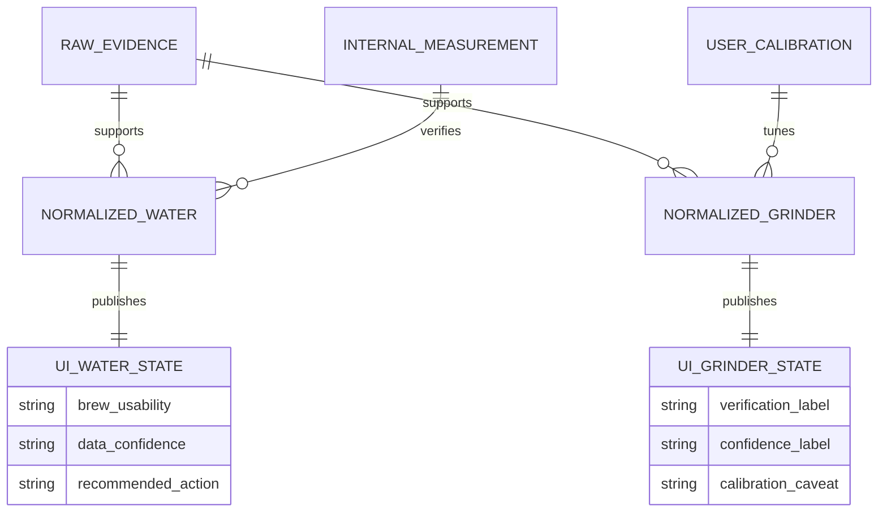
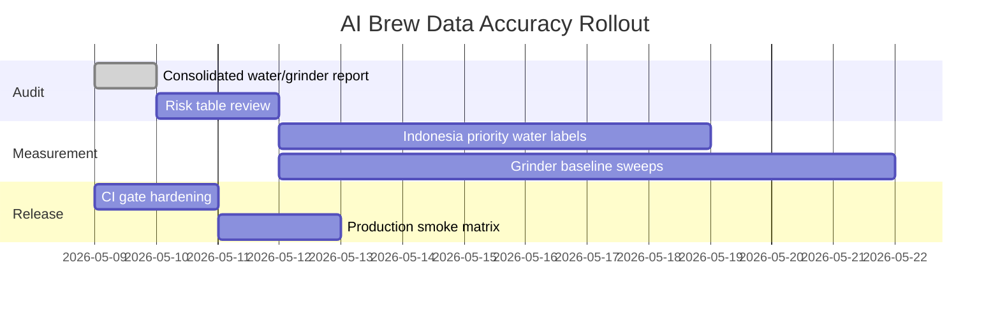

# AI Brew Data Accuracy Roadmap

AI Brew data should be traceable, measurable, and correctable. The goal is not to claim that every water or grinder value is absolute; the goal is to show the right confidence, action, and caveat for each record.

## Evidence Model

## Water Accuracy Roadmap

Priority markets: Indonesia, Brunei, Singapore, Malaysia, and global reference waters.

Priority waters: Aqua, Le Minerale, Cleo, Amidis, Vit, Ades, Club, Pristine, Nestle Pure Life, Crystalline, evian, Volvic, Acqua Panna, and any published water in the catalog.

Required evidence:

- Official brand water analysis page, official lab report, official label, or regulator report.
- Market and SKU scope, including package size where composition differs.
- TDS, GH/hardness or Ca/Mg, KH/alkalinity or bicarbonate, pH when available.
- `checked_at`, source URL, and review due date.

Internal measurement protocol:

- Use a calibrated TDS/EC meter with calibration solution.
- Use GH and KH titration kits.
- Use a pH meter and chlorine/chloramine strips where available.
- Measure TDS, GH, and KH in triplicate and store median values.
- Record brand, SKU, market, lot/date when available, package size, bottle state, temperature, equipment, and operator.

Promotion gates:

- `blocked`: missing critical evidence or contradictory data.
- `manual_only`: usable only through manual mineral input or remineralisation.
- `curated`: secondary or community evidence; do not show official copy.
- `verified`: internal measurement or strong public evidence is complete.
- `official`: official brand/lab/regulator source with market/SKU scope.

Low-mineral, RO, purified, and demineral waters must be treated as base water until remineralized. High-buffer waters can be brew-usable but must carry acidity/floral caution.

## Grinder Accuracy Roadmap

Priority grinders: 1Zpresso K-Ultra, 1Zpresso ZP6, 1Zpresso Q2/Q Air, Comandante C40, Timemore C2/C3/S3, Kingrinder K6, Hario Mini Slim, Feima 600N, Baratza Encore/ESP, Fellow Ode, and any published grinder in the catalog.

Required evidence:

- Official manufacturer manual, official product page, or official grind chart when available.
- Model and burr scope, unit style, click direction, zero-point caveat, and checked date.
- For curated data, keep source URLs and visible starting-point copy.

Calibration protocol:

- Record grinder model, burr type, zero point, click direction, and user offset.
- Use fixed coffee, roast level, roast age, dose, filter, method, water, temperature, and target profile.
- Run a three-setting sweep around the catalog baseline.
- Record drawdown, beverage TDS when available, sensory notes, and final setting range.
- Publish as a starting point, not exact truth.

## Rollout Timeline

## Release Rule

Do not promote external data into production unless the source licence and intended use are allowed or explicitly approved. If evidence is incomplete, downgrade confidence and show a manual, curated, or fallback action instead of inventing precision.
